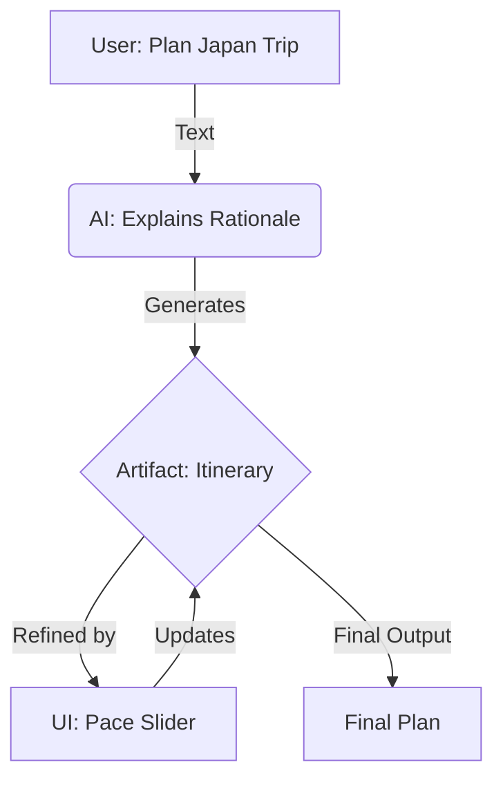

We have spent the last few years learning how to talk to machines. We've optimized our prompts, learned the nuance of context and marveled at the detailed responses we get back.

But as LLMs graduate from a novelty to daily productivity drivers, we are hitting a ceiling. The single-stream chat window is becoming a bottleneck for complex work.

Trying to architect a software system, perform deep financial analysis, or design a user journey solely through a text box is like trying to fly a plane using only a radio. You can communicate intent, but you lack precision control.

Text is a fantastic interface for reasoning. It is a terrible interface for building.

To move from simple Q&A to actual collaboration with AI, we need an architecture that supports different modes of thinking and responding. We need the **Triad of AI Interaction**: Text, UI, and Artifacts.

## The Framework: Text, UI, and Artifacts

A mature AI interface is an orchestration of three distinct output channels, used at the right time for the right purpose.

### 1. Text (The Narrator)

**The Function**: Text remains the ultimate interface for **ambiguity** and **reasoning**. It is the high-bandwidth channel where we clarify intent, ask "why?" and understand the logic behind a decision. When the problem space is undefined ("My app feels slow"), text is the only way to narrow it down.

**The UX**: Text acts as the "connective tissue" of the session. It shouldn't just be the output; it should explain the *reasoning* behind the output.

* ✅ **Best for**: Open-ended discovery, explaining complex logic, and setting initial direction.
* ❌ **Worst for**: Tweaking parameters ("Move it 5px left") or selecting from known options.
* 💡 **Examples**: Standard chat interfaces like [ChatGPT](https://chatgpt.com), [Claude](https://claude.ai), or [Gemini](https://gemini.google.com).

### 2. UI (The Cockpit)

**The Function**: Natural language is powerful, but it is often horribly inefficient for **precision** and **constraint**. Sometimes, you don't want an open-ended conversation; you want a specific set of choices.

**The UX**: This is the domain of **Generative UI** (similar to patterns like Adaptive Cards), ephemeral interfaces generated on-the-fly to solve specific friction points. Instead of forcing the user to type "change the date range to Q3 and filter by region North, " the agent proactively renders interactive controls, calendars, dropdowns, and sliders, right in the flow.

**The Cognitive Shift**: It moves the user from "describing" to "directing." This leverages Nielsen's heuristic of **Recognition over Recall**, it is easier to recognize the right option than to recall the command to generate it.

* ✅ **Best for**: Adjusting parameters, selecting options, and rapid iteration.
* ❌ **Worst for**: Explaining abstract concepts or defining broad goals.
* 💡 **Examples**: [OpenAI ChatKit Widgets](https://platform.openai.com/docs/guides/chatkit-widgets), [Vercel AI SDK (Generative UI)](https://ai-sdk.dev/docs/ai-sdk-ui/generative-user-interfaces).

### 3. Artifacts (The Payload)

**The Function**: This is the critical shift for enterprise value. The conversation is ephemeral; the Artifact is permanent. It is the destination of the workflow. This supports **Distributed Cognition**, allowing users to offload the mental burden of tracking state to the artifact itself.

**The UX**: Whether it's a code block, a financial model in a spreadsheet, or a generated image, the Artifact must be **stateful** and **versioned**. It is the "source of truth" that we are iterating on together. Crucially, the user should be able to interact with the Artifact *directly* without breaking the agent's context.

* ✅ **Best for**: The final output, the tangible asset being built.
* ❌ **Worst for**: Meta-commentary or quick questions.
* 💡 **Examples**: [Claude Artifacts](https://www.anthropic.com/news/artifacts), [OpenAI Canvas](https://openai.com/index/introducing-canvas/).

### Visualizing the Loop

The interaction isn't a straight line; it's a cycle of refinement moving between these modes.

## The Symphony in Practice

What does this look like when it all comes together? It looks less like a chatroom and more like an intelligent studio.

Imagine planning a complex family vacation to Japan:

**Step 1: The reasoning (Text).** You ask the agent for an itinerary that balances culture for adults and fun for kids. It replies with a textual rationale explaining why Kyoto is better than Tokyo for this specific mix, citing pace and walkability.

**Step 2: The object (Artifact).** It doesn't just list places in the chat; it generates a full interactive itinerary on a side canvas, a day-by-day map with pinned locations. This is a living Artifact, ready to be shared.

**Step 3: The precision tweak (UI).** You realize the schedule is too packed. Instead of typing "remove the afternoon activities on Tuesday, " the agent recognizes the intent and surfaces a set of UI sliders next to the map: `Pace: [Relaxed] ---- [Intense]`, `Budget: [$] ---- [$$$]`.

You slide the pace to "Relaxed." The Artifact updates instantly, removing low-priority stops. The Text pane explains what was cut and why.

## The Future is Multimodal

We are moving past the era of "turn-taking" with AI, I speak, you speak. We are entering the era of orchestration, a concept deeply rooted in the **Microsoft Research Human-AI Interaction Guidelines** for efficient correction and social-emotional calibration.

The most successful AI workflows of the future will understand that sometimes the best answer is a sentence, sometimes it's a slider, and sometimes it's a neatly packaged file.

By balancing Text for understanding, UI for interaction, and Artifacts for ownership, we stop just "chatting" with AI. We start building with it.

